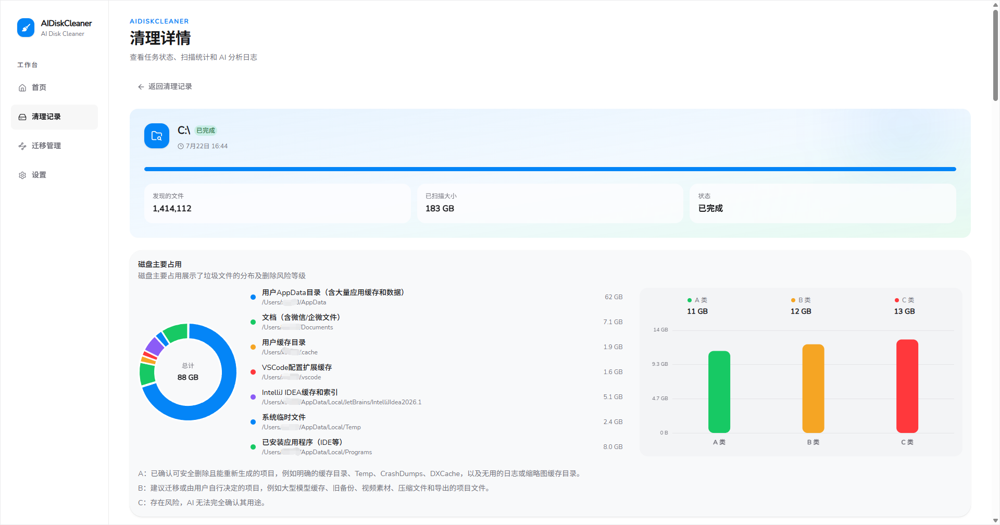
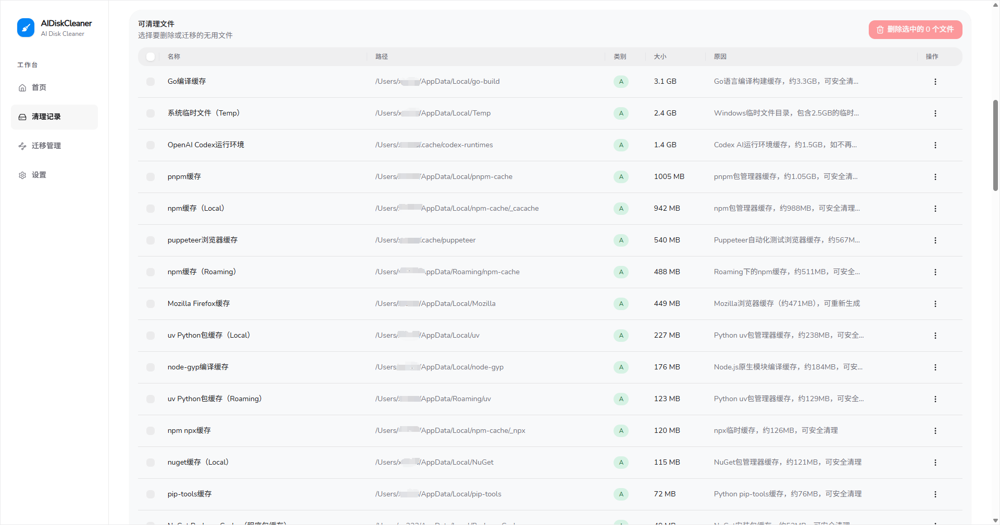
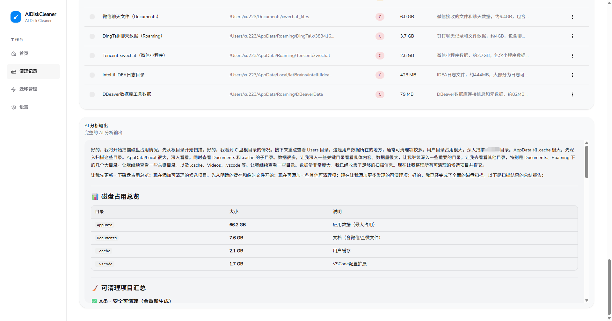
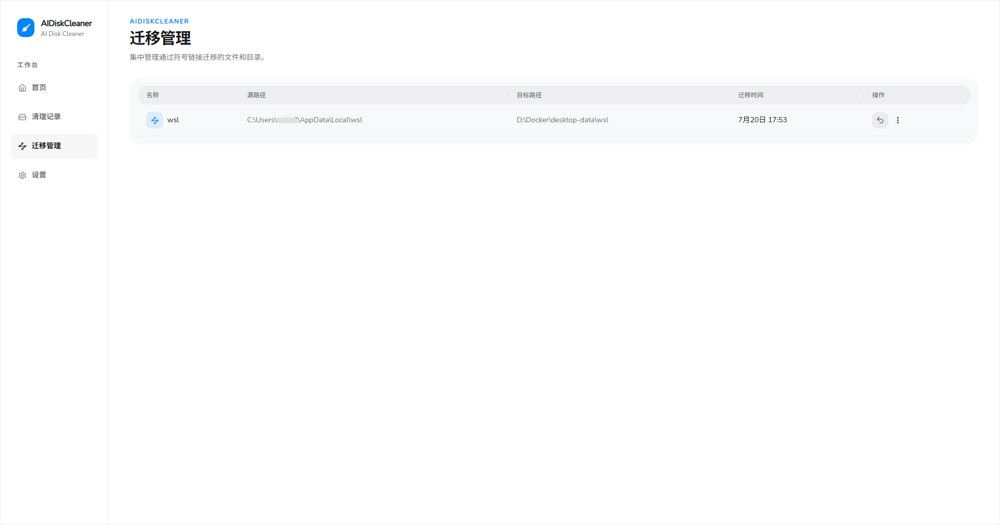

# ai-disk-cleaner

一款 AI 驱动的智能磁盘清理助手。

支持的功能:

- 🤖 LLM 智能分析: LLM 智能分析磁盘占用，扫描可以删除的垃圾，并汇总结果展示
- 📦 迁移管理: 提供了软链接的统一管理，支持一键迁移文件到其它盘中

## 快速开始

1. 从 [Release](https://github.com/vudsen/ai-disk-cleaner/releases) 列表中下载最新版本 exe (目前仅支持 Windows)
2. 下载完毕后，将 exe 放在一个单独的文件夹中(应用启动后会在 exe 当前目录生成数据文件)
3. 打开应用 (推荐以管理员权限打开，否则某些删除或迁移操作可能会报错)
4. 进入设置页面，配置大模型参数
5. 回到首页，开始扫描

## 运作原理

整个架构分为三步:

1. 使用 [gdu](https://github.com/dundee/gdu) 扫描指定位置，并将文件树加载到内存中
2. 暴露读取文件树的工具，让 LLM 分析文件树，找出占用最大的文件。在找到垃圾文件后 LLM 会调用 [add_trash_file](backend/service/analyzer/tools.go) 工具来标记文件
3. 系统汇总 LLM 分析结果，展示给用户 
