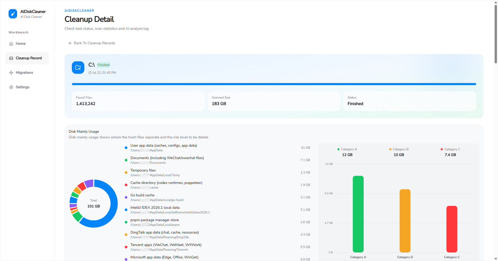
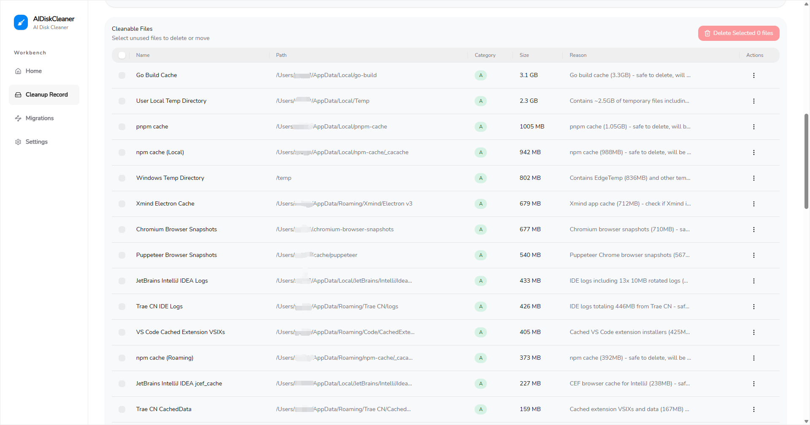
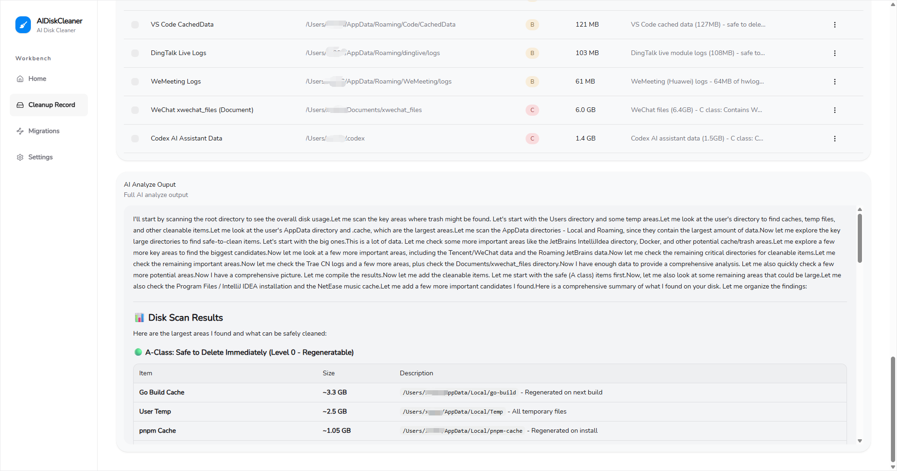
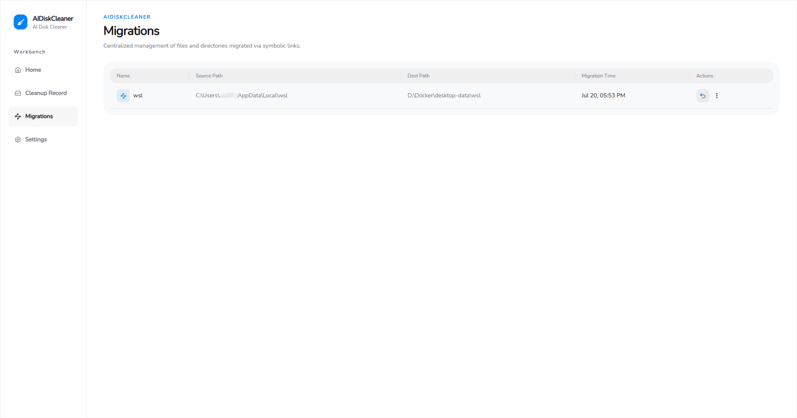

# ai-disk-cleaner

[简体中文](./README-zh_CN.md)

An AI-powered intelligent disk cleanup assistant.

Features:

- 🤖 Intelligent LLM analysis: Uses an LLM to analyze disk usage, identify removable junk files, and present a summary of the results
- 📦 Migration management: Provides centralized management of symbolic links and supports one-click file migration to other drives

## Quick Start

1. Download the latest `.exe` from the [Releases](https://github.com/vudsen/ai-disk-cleaner/releases) page (currently Windows only).
2. Place the downloaded `.exe` in a dedicated folder. The application will create its data files in the executable's current directory after startup.
3. Launch the application. Running it as an administrator is recommended; otherwise, some deletion or migration operations may fail.
4. Open the Settings page and configure the LLM parameters.
5. Return to the home page and start scanning.

## How It Works

The entire architecture are three steps:

1. Use [gdu](https://github.com/dundee/gdu) to scan the specific location and load the file tree into memory.
2. Expose a file tree reading tool to the LLM and let it find the trash file. When the trash file is found, the LLM invokes the [add_trash_file](backend/service/analyzer/tools.go) tool to mark the file.
3. Combine the LLM analysis results and display them to the user.
